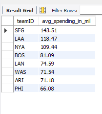
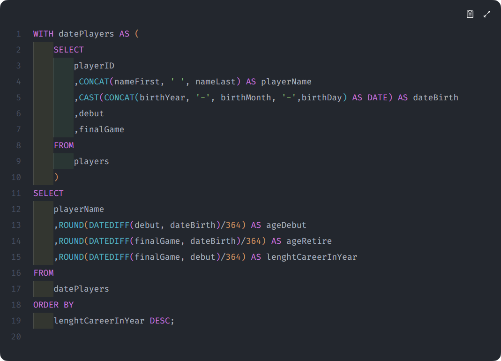
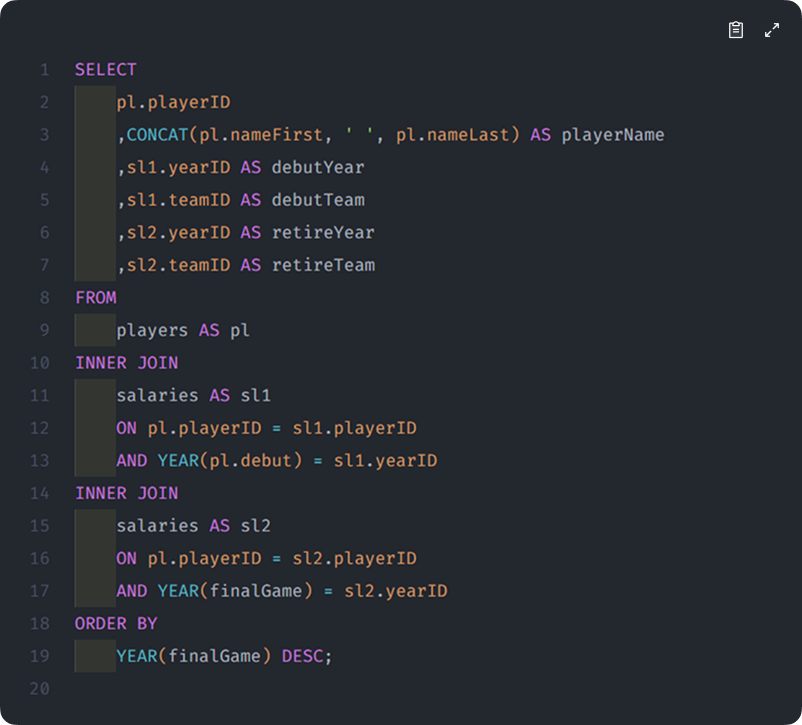

# SQL-project-analysis

Leverage everything i have learned in "[SQL for Data Analysis: Advanced SQL Querying Techniques](https://www.udemy.com/share/10cfwd3@RpilmZbx1xxlcnvLWO-Pi7_3GnxJ-NXyvwVk2x-d2gBM9EwzR53WTViwq3sIk695/)" to track how Major League Baseball (MLB) player statistics have changed over time and across different teams in the league.

## THE SITUATION
You've just been hired as a Data Analyst Intern for Major League Baseball (MLB), who has recently gotten access to a large of historical player data.

## THE ASSIGNMENT
You have access to decades worth of data including player statistics like schools attended, salaries, teams played for, height and weight, and more.
Your task is to use advanced SQL querying techniques to track how player statistics have changed over time and across different teams in the league.

## THE OBJECTIVES
1. [What schools do MLB players attend?](#1-What-schools-do-MLB-players-attend?)
2. [How much do teams spend on player salaries?](2-how-much-do-teams-spend-on-player-salaries)
3. [What does each player's career look like?](3-What-does-each-player's-career-look-like?)
4. [How do player attributes compare?](4-How-do-player-attributes-compare?)
  
# THE SOLUTIONS
## 1. What schools do MLB players attend?
   - a) In each decade, how many schools were there that produced MLB players?
     | MySQL Query | Result |
     |----------|----------|
     |  |  |
   - b) What are the names of the top 5 schools that produced the most players?
     | MySQL Query | Result |
     |----------|----------|
     |  |  |
   - c) For each decade, what were the names of the top 3 schools that produced the most players?
     | MySQL Query | Result |
     |----------|----------|
     |  |  |

## 2. How much do teams spend on player salaries?
   - a) Return the top 20% of teams in terms of average annual spending
     | MySQL Query | Result |
     |----------|----------|
     |  |  |
   - b) For each team, show the cummulative sum of spending over the years
     | MySQL Query | Result |
     |----------|----------|
     |  |  |
   - c) Return the first year that each team's cumulative spending surpassed 1 billion
     | MySQL Query | Result |
     |----------|----------|
     |  |  |

## 3. What does each player's career look like?
   - a) For each player, calculate their age at their first (debut) game, their last game, and their career length (all in years). Sort from longest career to shortest career?
     | MySQL Query | Result |
     |----------|----------|
     |  |  |
   - b) What team did each player play on for their starting and ending years?
     | MySQL Query | Result |
     |----------|----------|
     |  |  |
   - c) How many players started and ended on the same team and also played for over a decade?
     | MySQL Query | Result |
     |----------|----------|
     |  |  |

## 4. How do player attributes compare?
   - a) Wich player have the same birthday?
     | MySQL Query | Result |
     |----------|----------|
     |  |  |
   - b) Create a summary table that shows for each team, what percent of players bat right, left, and both
     | MySQL Query | Result |
     |----------|----------|
     |  |  |
   - c) How have average height and weight at debut game changed over the years, and what's the decade-over-decade difference?
     | MySQL Query | Result |
     |----------|----------|
     |  |  |

_Source Data: Maven Analytic_
